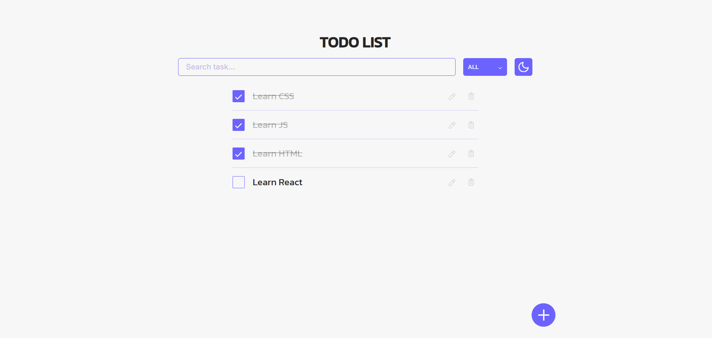
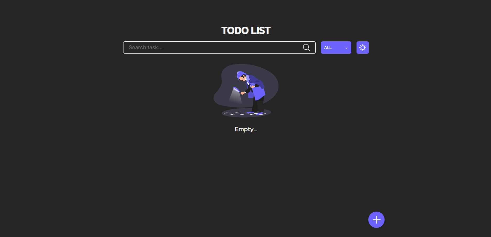

# Todo List

A responsive Todo List application built with Vanilla JavaScript to practice DOM manipulation, modular architecture, state management, and Local Storage.

The application allows users to create, edit, delete, search, and filter tasks. All data is stored in the browser using **Local Storage**, so tasks remain available after refreshing the page.

## Live Demo

🔗 https://vladislav-b.github.io/todo-list/

## Preview

### Light Theme



### Dark Theme



---

## Features

* Create new tasks
* Edit existing tasks
* Delete tasks
* Mark tasks as completed
* Search tasks by title
* Filter tasks:

  * All
  * Completed
  * Incomplete
* Light/Dark theme switching
* Persistent data with Local Storage
* Responsive design

---

## Technologies

* HTML5
* CSS3
* JavaScript (ES6)
* DOM API
* Local Storage API

---

## Folder Structure

```text
.
├── css/
│   ├── components/
│   ├── sections/
│   ├── fonts.css
│   ├── global.css
│   ├── normalize.css
│   ├── variables.css
│   └── main.css
│
├── js/
│   ├── service/
│   ├── ui/
│   ├── render.js
│   ├── state.js
│   ├── localStorage.js
│   └── main.js
│
├── icons/
├── images/
├── index.html
└── README.md
```

---

## Installation

Clone the repository:

```bash
git clone https://github.com/Vladislav-b/todo-list.git
```

Go to the project folder:

```bash
cd todo-list
```

Open `index.html` in your browser or run the project using **Live Server**.

---

## What I Practiced

During this project I practiced:

* DOM manipulation
* Event delegation
* Modular JavaScript architecture
* State management
* Local Storage
* Searching and filtering data
* Responsive layout
* Theme switching
* Code organization into modules

---

## Future Improvements

* Drag & Drop task sorting
* Task priorities
* Categories
* Due dates
* Animations
* Unit tests

---

## Author

**Vladislav**

GitHub: https://github.com/Vladislav-b
